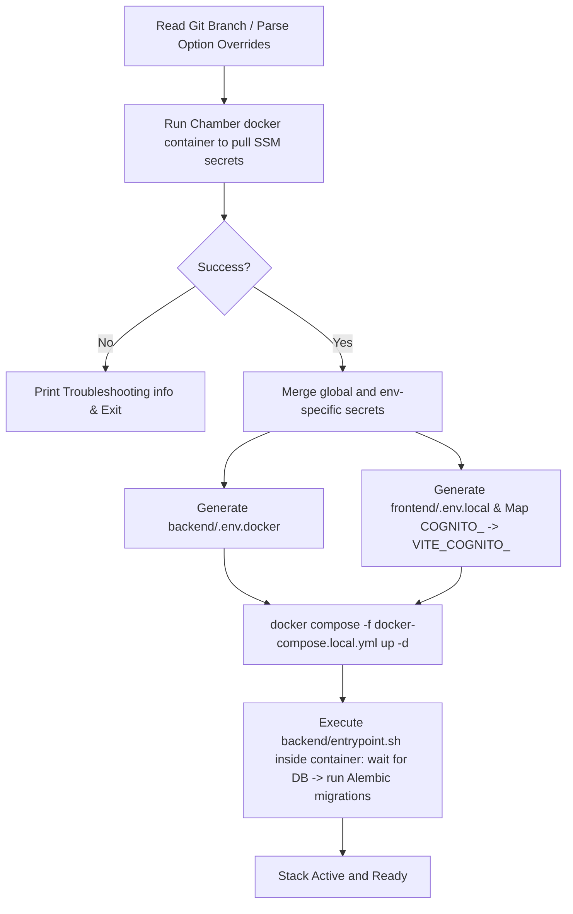

# Local Development Orchestrator Guide (`run-local.sh`)

This guide explains how to use the `run-local.sh` orchestrator script for running the AxioraPulse stack locally. The script automates pulling secrets from AWS Systems Manager (SSM) Parameter Store, generating environment configuration files, and bringing up the containerized application.

---

## 🚀 Overview

The `run-local.sh` script is a bash utility designed to simplify local development by:
1. **SSM secrets integration**: Utilizing the `segment/chamber` Docker image to securely fetch global and environment-specific credentials from AWS SSM Parameter Store.
2. **Dynamic configuration mapping**: Generating local `.env` files for both frontend and backend on-the-fly, transforming Cognito credentials into Vite-compatible variables.
3. **Docker Compose orchestration**: Spinning up a consistent local environment containing PostgreSQL, the FastAPI backend, and the React/Vite frontend.

---

## 📋 Requirements & Prerequisites

Before running the orchestrator, ensure your machine satisfies the following dependencies:

### 1. Docker & Docker Compose
- **Docker Desktop** (macOS/Windows) or the **Docker Daemon** (Linux) must be installed and running.
- Docker must have permission to mount your `$HOME/.aws` directory (this is default on most setups).

### 2. AWS Credentials & Access
- You need an active AWS CLI session with access to the parameter store paths for AxioraPulse.
- If your team uses AWS SSO, run the login command for the appropriate profile before executing the script:
  ```bash
  aws sso login --profile <profile-name>
  ```
- Alternatively, you can configure your credentials using standard AWS environment variables:
  - `AWS_ACCESS_KEY_ID`
  - `AWS_SECRET_ACCESS_KEY`
  - `AWS_SESSION_TOKEN` (if using temporary credentials)
  - `AWS_REGION` or `AWS_DEFAULT_REGION` (defaults to `ap-south-1` inside Chamber)

### 3. Git
- Git is used by the script to detect the active branch. Branch detection dictates which default AWS profile and SSM Parameter Store namespace will be used.

---

## 🗺️ Branch-to-Environment Mappings

By default, `run-local.sh` dynamically chooses your configuration based on the Git branch you currently have checked out:

| Active Git Branch | Default AWS Profile | Target SSM Environment | Resolved SSM Namespace |
| :--- | :--- | :--- | :--- |
| `main` | `default` | `production` | `/axiorapulse/production` & `/axiorapulse` |
| `staging` | `qa` | `staging` | `/axiorapulse/staging` & `/axiorapulse` |
| `develop` / Others | `dev` | `dev` | `/axiorapulse/dev` & `/axiorapulse` |

> [!NOTE]
> Feature branches or any custom branch names default to using the `dev` profile and environment.

---

## 💻 Usage & Options

Run the script from the root directory of the repository:

```bash
./run-local.sh [options]
```

### Options

| Short Flag | Long Flag | Description |
| :--- | :--- | :--- |
| `-r` | `--rebuild` | Forces rebuilding of the frontend and backend Docker images and recreates anonymous volumes. |
| `-d` | `--down` | Stops and tears down the active local container stack (retaining persistent DB volume). |
| `-p [profile]`| `--profile [profile]` | Overrides the AWS profile (e.g. `./run-local.sh -p my-custom-profile`). |
| `-e [env]` | `--env [env]` | Overrides the SSM Parameter Store environment (e.g. `dev`, `staging`, `production`). |
| `-h` | `--help` | Displays the help menu. |

### Common Workflows

#### 1. Standard Startup
Fetches dev secrets using your `dev` profile and runs the container stack:
```bash
./run-local.sh
```

#### 2. Rebuilding the Environment
Rebuilds the Docker images from scratch (e.g. after dependency updates in `package.json` or `requirements.txt`):
```bash
./run-local.sh --rebuild
```

#### 3. Simulating Staging Environment Locally
Bypasses the Git branch detection to run the app using staging credentials:
```bash
./run-local.sh --profile qa --env staging
```

#### 4. Shutting Down
Stops all containers and cleans up local networking:
```bash
./run-local.sh --down
```

---

## 🔌 Reached Ports & Services

Once the orchestrator successfully starts, the following services are exposed:

- **Frontend User Interface**: [http://localhost:5173](http://localhost:5173) (Vite dev server with hot reloading enabled)
- **Backend API**: [http://localhost:8000](http://localhost:8000)
- **API Interactive Swagger Docs**: [http://localhost:8000/docs](http://localhost:8000/docs)
- **Local PostgreSQL Database**: `localhost:5432` (database name: `nexpulse`, user: `postgres`, password: `root`)

---

## ⚙️ How It Works (Under the Hood)

When you execute `./run-local.sh`, it executes the following steps sequence:



1. **Secret Resolution**: The script runs the `segment/chamber` Docker image twice:
   - First to pull global parameters from `/axiorapulse`
   - Second to pull environment-specific parameters from `/axiorapulse/<env>`
2. **Environment File Generation**:
   - **Backend**: Generates [backend/.env.docker](file:///Users/roopsaisurampudi/projects/AxioraPulse/backend/.env.docker) and appends local overrides like `DATABASE_URL` pointing to the internal Postgres service name (`pulse-db`).
   - **Frontend**: Generates [frontend/.env.local](file:///Users/roopsaisurampudi/projects/AxioraPulse/frontend/.env.local), mapping custom credentials prefixed with `COGNITO_` into Vite variables (prefixed with `VITE_COGNITO_`) and setting `VITE_API_BASE_URL` to `http://localhost:8000`.
3. **Orchestration**: Runs `docker compose -f docker-compose.local.yml up -d` to mount backend and frontend files from your host machine for development (enabling live-reload support).

---

## 🛠️ Troubleshooting

### ❌ Error: "Failed to pull environment-specific secrets using Chamber"

This means Chamber failed to fetch parameters from AWS SSM. Check the following:

1. **Expired AWS Session**: If you are using AWS SSO, your session likely expired. Refresh it by running:
   ```bash
   aws sso login --profile <profile>
   ```
2. **Missing ~/.aws Directory**: Verify your AWS credentials directory exists. Chamber mounts `$HOME/.aws` to load profiles.
3. **SSM Parameter Namespace**: Make sure the target SSM namespace (e.g. `/axiorapulse/dev`) exists in the `ap-south-1` region and your credentials have permission to read from it.

### ❌ Docker Mounting Permissions / Volume Stuck
If you run into issues where CSS classes, modules, or code changes do not reflect:
1. Try rebuilding the containers and forcing anonymous volume recreation:
   ```bash
   ./run-local.sh --rebuild
   ```
2. Inspect the Docker logs:
   ```bash
   docker compose -f docker-compose.local.yml logs -f
   ```

### ❌ Database Migrations Failing on Startup
If you get warnings about Alembic migrations failing because of database mismatch when switching branches:
- The backend container automatically attempts to self-recover by running `alembic stamp head` and reapplying migrations.
- If it fails, you can force-recreate your database storage volume by running:
  ```bash
  docker compose -f docker-compose.local.yml down -v
  ./run-local.sh --rebuild
  ```
  *(Note: This resets your local database contents).*
