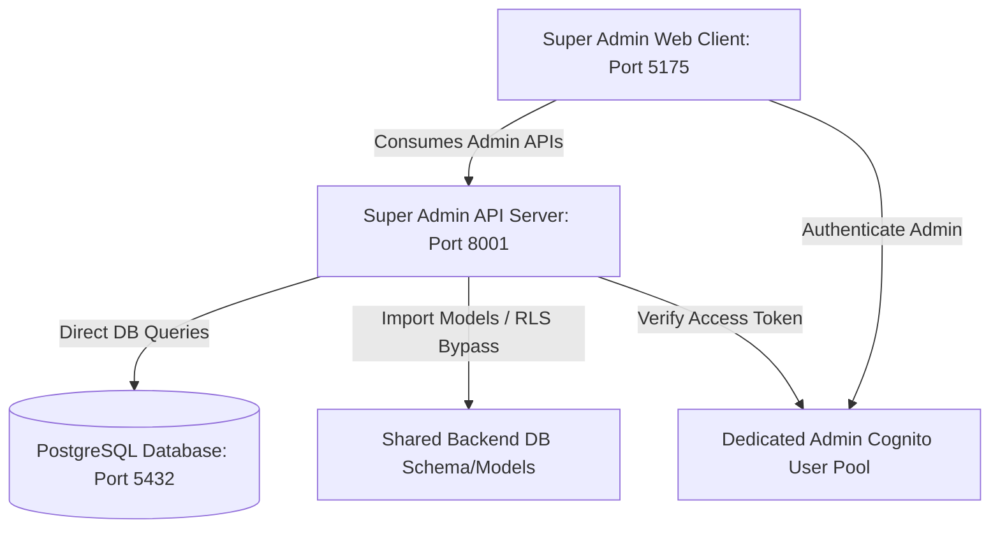

# Axiora Pulse - Super Admin Console

This is the Super Admin Console for the Axiora Pulse platform, located in a completely separate top-level directory (`super-admin/`). It is architecturally independent of the main customer-facing frontend and backend services.

## Architecture

The console is split into two components:
1. **Backend Server (`server/`)**: A FastAPI Python backend that communicates directly with the shared PostgreSQL database. It dynamically imports and reuses the existing backend's database models, ensuring zero duplication.
2. **Frontend Web Client (`web/`)**: A React web application bootstrapped with Vite. It features a premium, responsive dark dashboard built using Vanilla CSS.



## Security & Authentication

- **Cognito Integration**: Authentication is configured via a dedicated AWS Cognito User Pool distinct from the customer-facing one.
- **Domain Whitelisting**: The API server strictly rejects any authenticated user whose email domain is not `@axioraglobalsolutions.com`.
- **RBAC (Role-Based Access Control)**: Enforces `super_admin` or `admin` permissions on all endpoints.
- **Audit Trails**: Every state-changing admin action (such as modifying roles, changing activation status, or deleting records) is logged to the existing `audit_logs` database table.

## Quick Start

### 1. Setup Environment
Copy the example configuration to `.env` in both the server and web directories (or set them globally).
```bash
cp .env.example server/.env
cp .env.example web/.env
```

### 2. Run Backend Server
Ensure Python 3.10+ is installed:
```bash
cd server
python -m venv venv
source venv/bin/activate
pip install -r requirements.txt
python main.py
```
The server will run on `http://localhost:8001` with interactive docs available at `http://localhost:8001/docs`.

### 3. Run Frontend Web App
Ensure Node.js 18+ is installed:
```bash
cd web
npm install
npm run dev
```
The web dashboard will run on `http://localhost:5175`.
